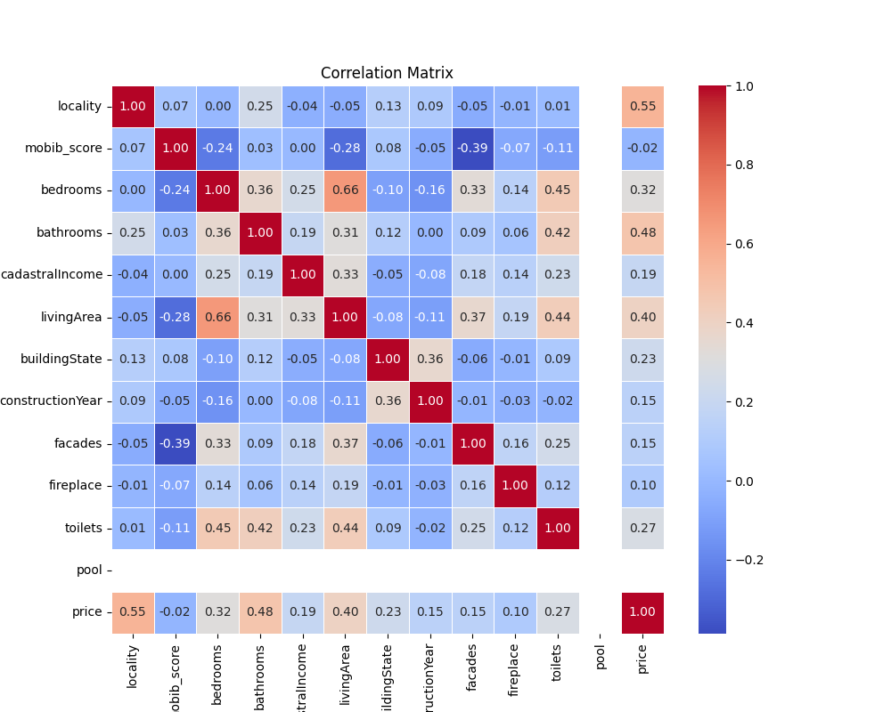
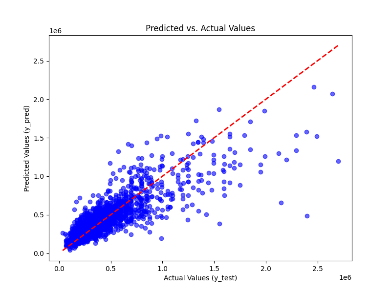
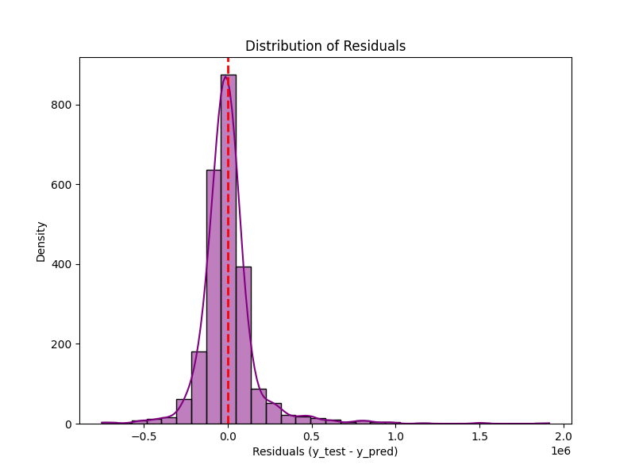

# immoEliza_propertyPrice_predictor

## Dataset description
- The training and test dataset comes from data scrapped as a part of our previous project from the site [Immoweb](https://www.immoweb.be/)

### Shape

- The dataset is initially composed of 16,408 entries and 35 features each.

#### Selected Features list

1. Locality : The locality where the property is located.
2. mobib_score : A float number.
3. livingArea : A float in square meter.
4. bedrooms : A float in square meter.
5. bathrooms : A float in square meter.
6. toilets : A float in square meter.
7. fireplace : *Does the property have an open fire ?* A boolean either true or false.
8. Number of facades : A float number representing the number of facades of the property.
9. Swimming pool : A boolean. Either true or false.
10. State of the building : Either 'medium', 'good', 'new', 'to renovate', regarding the state of the property.

#### Target
1. Price : A float number in euros.

## WorkFlow
The following steps will be explored in more details below

1. Data analysis
2. Data preprocessing
3. Model selection: Linear Regression(ElasticNet)
4. Model training
5. Model evaluation
6. Results interpretation
7. Possible Improvements done.

## Data analysis

Some insights on the dataset. 

Price correlation with the other features : 

- locality            0.554733
- bathrooms           0.476861
- livingArea          0.401326
- bedrooms            0.315892
- toilets             0.274314
- buildingState       0.227274
- cadastralIncome     0.191139
- facades             0.148701
- constructionYear    0.147859
- fireplace           0.100461
- mobib_score        -0.017061
- pool                     NaN 

Heatmap :  

## Data preprocessing

Some features needed to be transformed to be able to train and test our model with it. 
Here are the said transformation and the respective library used:

- Handle the missing data and outliers in the dataset 
- Custom encoding of the categorical column 'buildingState'
- Separating the data between the train and the test set
- Target encoding of the categorical column 'Locality 
- Scaling the numerical columns and the encoded categorical columns
- PCA on the selected features/components.
- applied polynomialfeatures.

## Model selection

- Linear Regression( as defined by the project specifications)
 - ElasticNet

## Model training

The full dataset was split with a proportion of 0.8 for the training dataset.

## Hyperparameter Tuning
I used GridSearch to find the best hyperparameters.

## Model Evaluation
Here are the results of the model against the testing data : 

- Mean absolute error : 99264.07885355479
- r2 score : 0.6961092466021079

## Model coefficient matrix

Feature           Coefficient    Importance 
mobib_score       90526.756067   90526.756067
toilets           76244.994865   76244.994865
cadastralIncome   69345.434871   69345.434871
locality          69297.585222   69297.585222
constructionYear  51528.605724   51528.605724
buildingState    -36031.848536   36031.848536

## Results interpretation

When estimating the price, the main indicator to take into consideration is the MAE (Mean Absolute Error).  

On average there is a 99 000 euros difference between the price estimated by the model and the actual price. 
In reflexion to the prices available on the belgian market its still quite a high difference. 

## Visual interpretation:
Predicted vs Actual price scatter plot :  

Residual vs Predicted price scatter plot :  

Residual Density plot :  

## Possible improvements Done 

As the data cleaning and hyperparameter tuning has already been done in depth, my main question to ask is "the model".

In general , property price in belgium depends on many factors like structual , socio-economical, people entiments, market trends and many more. 
Firstly, taking only structural characteristics of the properties to predict the price would not be sufficient. 
secondly,the non-linear behaviour of those characteristics would make Linear Regression not a best fit in this case.

To stick to the project specifications of using Linear Regression, I thought of thinking of another type of linear regression model and considered ElasticNet with hyperparameters like max_iters , alpha,l1_ratio. 

To go even deeper into the information available for each property, one could retrieve information on the neighbourhood in which the property is located. Here are some questions that could be interesting and determining in the price of a house or a flat.

*How far away is the nearest public transport?*  

*How far is it to the schools?*  

*How far is it to the nearest supermarket?*  

Used OpenStreetMap (OSM) API, to calculate the proximity score or mobib score.